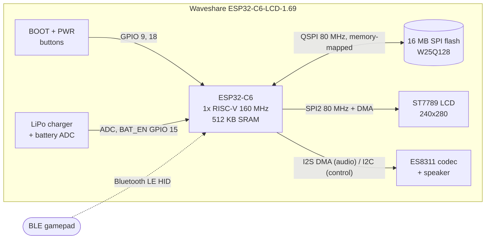
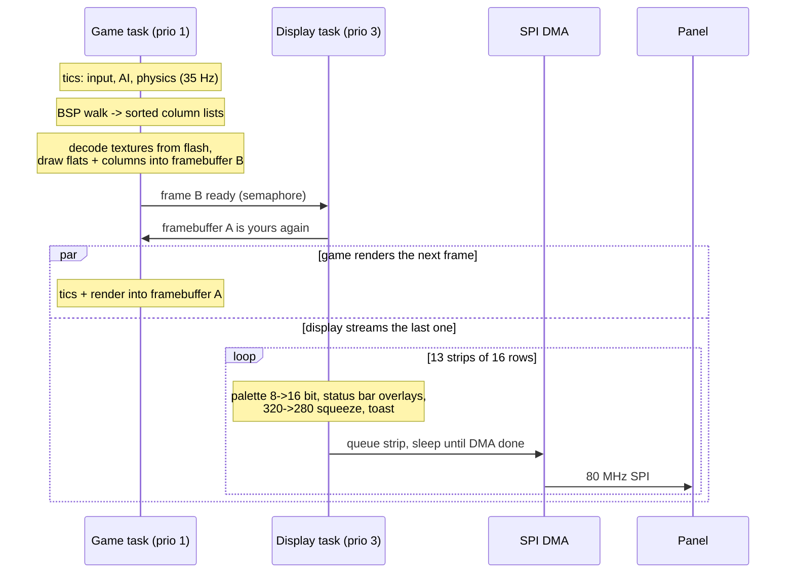
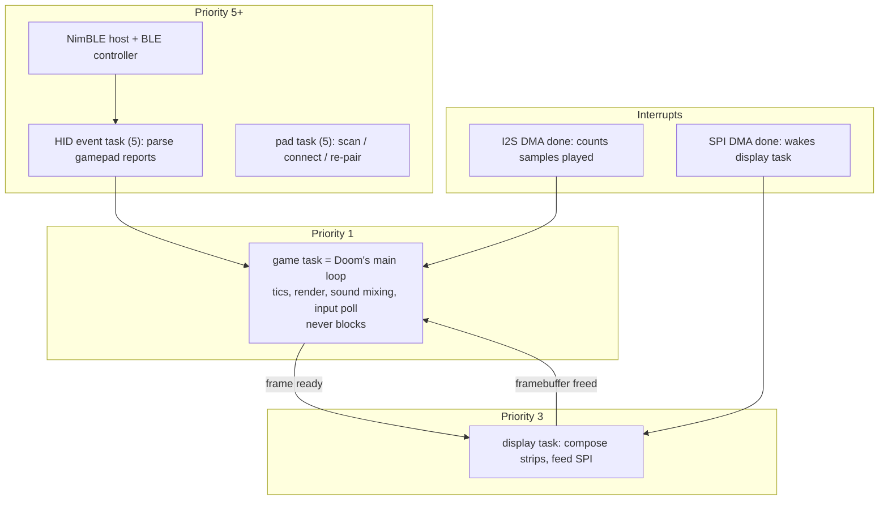
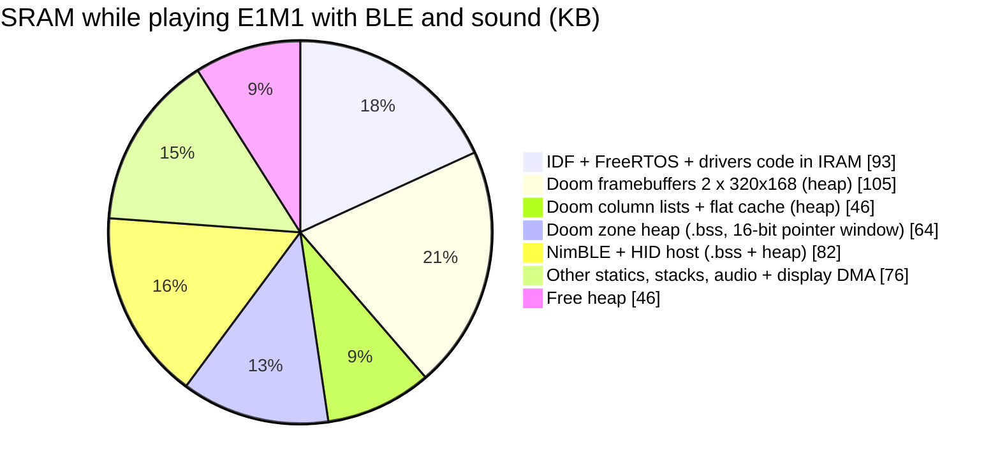
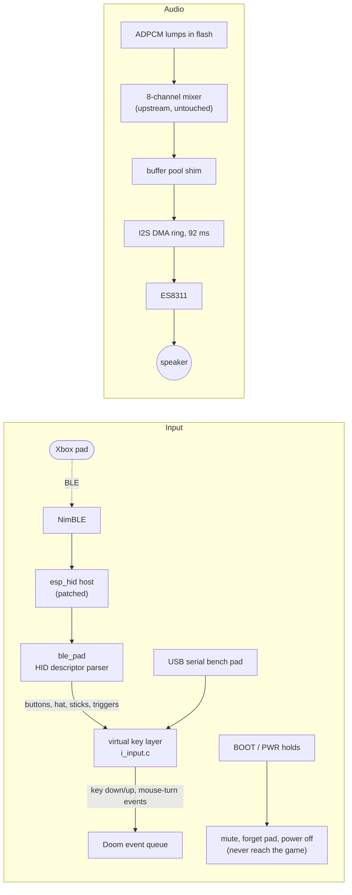
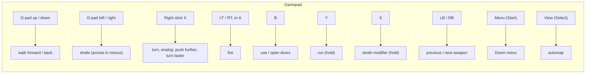

# DIABLITO

**The full shareware DOOM on a $20 ESP32-C6 board. No PSRAM. One 160 MHz RISC-V core. 512 KB of RAM. ~34 FPS, with sound, played with a Bluetooth gamepad.**

<!-- hero video / gif goes here -->

DIABLITO is a port of [Graham Sanderson's RP2040 Doom](https://github.com/kilograham/rp2040-doom) (a Chocolate Doom derivative) to ESP-IDF on the [Waveshare ESP32-C6-LCD-1.69](https://www.waveshare.com/esp32-c6-lcd-1.69.htm): a thumb-sized board with a 1.69" 240x280 LCD, a speaker, a LiPo charger and two buttons. All nine levels of `DOOM1.WAD`, the three attract-mode demos, the status bar, the menus, the screen melt, the automap, 8-channel sound effects. Nothing external: no PSRAM chip, no SD card, no second MCU.

| | |
|---|---|
| Frame rate, E1M1 gameplay | **34.5 FPS** mean, 99% of frames above 28 FPS |
| Frame rate, attract demos (5 min soak) | **33.2 FPS** mean, worst single frame 53 ms |
| Free heap while playing, BLE + sound running | 46 KB of 512 KB |
| Firmware image | 1.05 MB (Doom + ESP-IDF + NimBLE) |
| Game data | 2.07 MB (`doom1.whd`, the 4.2 MB WAD compressed, executed in place from flash) |
| Input | BLE HID gamepad (Xbox Wireless Controller tested) |
| Audio | 8-channel ADPCM mixer, 22 kHz, ES8311 codec over I2S |
| Boot to Doom's title screen | about 2 seconds |

Every number in this README was measured on the device over serial. The raw logs and the phase-by-phase engineering notes are in [`NOTES/`](NOTES/).

From the maker of [PELLETINO](https://github.com/aedile/PELLETINO), the tilt-controlled Pac-Man on this same board ([Hackster](https://www.hackster.io/news/power-up-with-pelletino-2efc18108047), [XDA](https://www.xda-developers.com/this-adorable-esp32-project-puts-pacman-on-a-tiny-169-screen/), [Boing Boing](https://boingboing.net/2026/02/04/pelletino-puts-a-tilt-controlled-pac-man-in-your-pocket.html)).

---

## Contents

- [Why this is hard on a C6](#why-this-is-hard-on-a-c6)
- [Architecture](#architecture)
- [Build your own](#build-your-own)
- [Getting it running](#getting-it-running)
- [Controls](#controls)
- [Customizing](#customizing)
- [Performance: what worked and what didn't](#performance-what-worked-and-what-didnt)
- [Repository layout](#repository-layout)
- [Status and known gaps](#status-and-known-gaps)
- [Credits and license](#credits-and-license)

---

## Why this is hard on a C6

"Doom runs on everything" usually means "everything with a few megabytes of RAM". The existing ESP32 ports (Espressif's `esp32-doom`, Retro-Go) are PrBoom builds that **require 4 MB of PSRAM**. The ESP32-C6 has none and no way to add it.

| | Classic ESP32 Doom ports | RP2040 Doom (the starting point) | **DIABLITO (ESP32-C6)** |
|---|---|---|---|
| CPU | 2 x Xtensa @ 240 MHz | 2 x Cortex-M0+ @ 270 MHz (overclocked) | **1 x RISC-V @ 160 MHz** |
| RAM | 520 KB + **4 MB PSRAM** | 264 KB | **512 KB, shared with Wi-Fi/BLE stacks** |
| Radio stack in RAM | optional | none | **NimBLE + HID host, always on (~82 KB)** |
| Display | SPI/parallel | PIO-driven VGA/DVI, beam-raced | SPI ST7789 @ 80 MHz with DMA |
| Special hardware used | PSRAM | PIO, hardware interpolators, hardware divider, hand-written ARM asm | none of those exist here |

RP2040 Doom proved the *memory* problem is solvable: it squeezes the WAD from 4.2 MB to 2 MB in a random-access compressed format (WHD), narrows Doom's structures to 16-bit, never loads a level into RAM, and renders through sorted column display-lists. But it leans on two fast cores and RP2040-only silicon. Porting it to a single slower core, with a Bluetooth stack squatting in a third of the RAM, is the work in this repo:

1. **Two cores became one, without faking it.** On the RP2040 core 1 beam-races the display, mixes sound, and renders half the columns. Here the render path was serialized, and the *only* thing given its own task is the display, because its cost is waiting: a finished frame streams out over SPI DMA in 16-row strips while the game is already rendering the next frame into the other framebuffer. The RP2040's original semaphore handshake between "core 0" and "core 1" is kept intact, mapped onto FreeRTOS.
2. **16-bit pointers that must reach everything.** Upstream stores pointers as 16-bit offsets with 4-byte granularity: a 256 KB window. On the RP2040 that covers all of RAM. On the C6 it covers half, and those pointers reference both heap objects *and* a couple of static variables. So `.bss` has to end inside the first 256 KB of SRAM: the zone heap lives in `.bss`, the big buffers (framebuffers, column lists) were evicted to the ESP-IDF heap, and boot aborts with a clear message if a future change pushes `.bss` past the line. Linking NimBLE blew through it by 31 KB the first time.
3. **Flash is the texture memory, and a cache miss costs 1.3 µs.** All level and graphics data is decoded straight out of a memory-mapped flash partition (`esp_partition_mmap`). Measured: 24 MB/s sequential, but ~1,300 ns (about 200 CPU cycles) per scattered 4-byte read through the 32 KB cache. The renderer's texture-sorted draw order is what makes that survivable.
4. **No interpolators, no ARM assembly.** Every RP2040 hardware trick was replaced with the portable C path first. RV32IMC's hardware multiply/divide turned out to be enough: `FixedMul` is a `mul`+`mulh` pair.
5. **Doom never yields, and BLE needs it to.** The game loop spins at priority 1 forever. Early builds delivered gamepad reports *seconds* late because the HID event task inherited that priority and starved behind a 5-deep queue. Priorities had to be designed, not defaulted.
6. **The 8:7 (or 4:3) squeeze.** Doom renders 320 wide; the panel is 280 (landscape) or 240 (portrait). Cropping would cut the ammo and health digits off the status bar, so each scanline is composed at 320 (palette + status bar overlays, exactly as upstream) and then dropped to 7-of-8 or 3-of-4 columns on its way into the DMA buffer, fused into the palette conversion so it costs nothing extra.
7. **The single biggest speedup was one compiler flag.** A sampling profiler (a 2 kHz timer ISR recording the interrupted PC) showed 37% of all time in one function. The cause: ESP-IDF builds with `assert()` enabled, the RP2040 build didn't, and the Huffman texture decoder asserts *per pixel*. `NDEBUG` took column drawing from 9-14 ms to 7-8 ms per frame.

The honest summary: the hard part was never "make Doom compile". It was fitting a BLE stack, an audio pipeline, two framebuffers, and a game designed around 264 KB into 512 KB, then finding 35 frames per second on one core.

---

## Architecture

### Hardware



Pin-level detail is in [`NOTES/hardware-map.md`](NOTES/hardware-map.md).

### One frame



The display task only burns CPU for the conversion (about 3 ms a frame); the 10-12 ms of wire time overlaps with the game's next frame. That is the whole reason it is a task.

### Tasks and priorities



Sound is mixed on the game task, never from another context, so the mixer needs no locks. It is paced by the DAC: a buffer is mixed only when the I2S DMA ring has room for all of it, so production is locked to the audio clock and the write never blocks.

### Memory (512 KB SRAM)



The constraint hiding in that chart: everything Doom reaches through a 16-bit pointer must sit in the first 256 KB, so the zone stays in `.bss` and the large buffers go to the heap. Details in [`NOTES/memory-budget.md`](NOTES/memory-budget.md).

### Flash (16 MB)

| Partition | Offset | Size | Contents |
|---|---|---|---|
| `nvs` | 0x9000 | 24 KB | BLE bonds, saved controller, mute, run log |
| `phy_init` | 0xF000 | 4 KB | RF calibration |
| `factory` | 0x10000 | 2 MB | firmware (1.05 MB used) |
| `wad` | 0x210000 | 4 MB | `doom1.whd`, memory-mapped read-only (2.07 MB used) |
| `saves` | 0x610000 | 128 KB | reserved for savegames |

### Input and audio paths



---

## Build your own

No soldering is needed if you run it from USB. For a pocket version, add a battery.

| Part | Notes | Link |
|---|---|---|
| **Waveshare ESP32-C6-LCD-1.69** | The whole computer: MCU, LCD, speaker, charger, buttons. About $20. Get the non-touch version. | [Amazon](https://a.co/d/hGBAeMq) · [Waveshare](https://www.waveshare.com/esp32-c6-lcd-1.69.htm) |
| **803040 3.7 V LiPo, 1000 mAh** (optional) | Plugs into / solders to the board's battery pads. About $9. | [Amazon](https://a.co/d/05E4ZhiI) |
| **BLE gamepad** | Xbox Wireless Controller, model 1708 or later (the ones with Bluetooth). This is how you play. | any retailer |
| USB-C data cable | For flashing and power | |

**Controller compatibility matters.** The C6 has Bluetooth *Low Energy* only. Pads that speak Bluetooth *Classic* can never connect: that rules out 8BitDo's small pads, DualShock 4 / DualSense, and Switch Pro / Joy-Cons. Xbox Wireless Controllers (2016+) are BLE HID and work. Other BLE HID gamepads should work through the generic HID descriptor parser, but only the Xbox pad is tested.

Assembly: connect the battery if you have one, plug in USB-C, flash. That's it. Any case that fits the Waveshare 1.69" board works; the board has a lanyard-friendly outline and the firmware supports both orientations.

---

## Getting it running

### 1. Prerequisites

- **Docker** (the build runs inside Espressif's official image, so you do not need ESP-IDF installed)
- **esptool** and **pyserial** on the host for flashing and the serial monitor: `pip install esptool pyserial` (or `brew install esptool`)
- macOS or Linux. Flashing happens on the host because Docker Desktop cannot see USB devices.

### 2. Clone

```sh
git clone https://github.com/aedile/DIABLITO.git
cd DIABLITO
```

The game data is already in the repo: `build-artifacts/doom1.whd`, generated from the freely redistributable shareware `doom1.wad`. (The `third_party/` submodules are only needed if you want to rebuild that file, see [Customizing](#customizing).)

### 3. Build

```sh
./build.sh                              # portrait (default)
./build.sh build -DDISPLAY_PORTRAIT=0   # landscape
```

First build pulls `espressif/idf:v5.3.4` (about 3 GB) and takes a few minutes. The orientation choice sticks in the build cache until you pass the flag again.

### 4. Flash

Plug the board in over USB-C, then:

```sh
./flash.sh                  # finds /dev/cu.usbmodem* or /dev/ttyACM*
./flash.sh /dev/ttyACM0     # or name the port
```

This writes the bootloader, partition table, firmware, and the 2 MB game data in one pass (about 25 seconds). If the board does not enumerate, hold **BOOT** while plugging it in.

### 5. First boot

Doom's title screen appears about two seconds after power-on, then the attract-mode demos loop forever. The display never sleeps.

**Pair a controller:** put the Xbox pad in pairing mode (hold the pair button until the logo blinks fast) near the board. With no controller saved, DIABLITO takes the first BLE gamepad it sees, bonds with it, and remembers it. After that the pad reconnects by itself whenever it wakes up. Press any button to open the menu over the demo, **A** on *New Game*, pick a skill, and you are in E1M1.

### 6. Watch it work (optional)

```sh
./tools/monitor.py 30                   # reset the board, print 30 s of console
./tools/monitor.py 60 run.log           # ...and save it
```

You get a line per frame (`frame 1234: 29012 us total, 11650 us display`), a memory and audio health line every 256 frames, gamepad connect events, and every input edge.

### Troubleshooting

| Symptom | Fix |
|---|---|
| Pad will not connect after it was paired to something else | Put it in pairing mode again; DIABLITO detects the stale bond, forgets it, and re-pairs within a few seconds. Or hold **BOOT 10 s** to forget the controller manually. |
| Pad never shows up at all | It is probably a Bluetooth Classic pad. See compatibility above. |
| Character walks by itself | Your pad's left stick is drifting. Left-stick movement is off by default for exactly this reason; see `LEFT_STICK_MOVE` below. |
| Black screen after flashing | Run `./tools/monitor.py 10` and read the log; a `.bss overruns the short-pointer window` abort means a code change grew static RAM past the 16-bit pointer limit. |
| `flash.sh` cannot find the port | Pass it explicitly. On Linux you may need to be in the `dialout` group. |

---

## Controls



| Gamepad | In game | In menus |
|---|---|---|
| D-pad up / down | walk forward / back | move selection |
| D-pad left / right | strafe | adjust sliders |
| Right stick (X axis) | turn, proportional with a fine-aim curve | |
| A, LT, RT | fire | select / confirm ("y" on prompts) |
| B | use (doors, switches) | back / decline ("n" on prompts) |
| Y (hold) | run | |
| X (hold) | strafe modifier: d-pad turns become strafes | |
| LB / RB | previous / next weapon | |
| Menu button | open / close the Doom menu | |
| View button | automap | |
| any button during the title or a demo | opens the menu | |

**On-device buttons are device controls only. They never reach the game.**

| Button | Hold | Does |
|---|---|---|
| BOOT | 3 s | mute / unmute (remembered across power cycles), with an on-screen toast |
| BOOT | 10 s | forget the paired controller and open pairing |
| PWR | 3 s | power off (on battery; on USB the screen just goes dark until reset) |

**Bench pad.** Keys typed into the USB serial console act as a gamepad, which is how the menus and gameplay were regression-tested without hands on the device: `w s a d` d-pad, `j k u i o p` = A B X Y LB RB, `q` Menu, `e` View, `l` BOOT. `tools/monitor.py 90 out.log --script "20:q,23:j,26:j"` sends keys on a schedule (seconds:key).

---

## Customizing

| What | Where | How |
|---|---|---|
| **Orientation** | build flag | `./build.sh build -DDISPLAY_PORTRAIT=0` for landscape (280x200 image, 20 px bars) or `=1` for portrait (240x200 image, 40 px bars). To flip portrait 180°, change MADCTL `0x00` to `0xC0` in `components/display/src/display.c`. |
| **Button mapping** | `components/doom/esp/i_input.c`, table `vkeys[]` | Each pad button posts up to three Doom key codes (its in-game meaning and its menu meaning). Edit the table. |
| **Which HID button is which** | `components/ble_pad/ble_pad.c`, `map_buttons()` | Default is Xbox BLE numbering. This is the one controller-specific function; sticks, hat and triggers come from the generic HID descriptor parser. |
| **Left-stick analog movement** | `LEFT_STICK_MOVE` in `i_input.c` | Set to 1 for analog walk/run on the left stick (through Doom's own mouse-forward path) plus strafe on its X axis. Off by default because the test pad's stick drifted. |
| **Turn speed, deadzone** | `TURN_MAX`, `STICK_DEAD`, `TRIGGER_ON` in `i_input.c` | Full stick equals the keyboard's fast-turn rate by default. |
| **Screen sleep** | NVS key `medal/idle_s`, or `-DIDLE_SLEEP_S=120` at build | Off by default (attract mode stays on screen). When enabled, the panel sleeps after N idle seconds in attract and wakes on any button. |
| **Audio sample rate** | `PICO_SOUND_SAMPLE_FREQ` in `components/doom/CMakeLists.txt` | 22050 by default. Doom's samples are 11025 Hz. |
| **Doom's heap** | `DOOM_ZONE_SIZE` in `components/doom/esp/i_system.c` | 64 KB; peak use measured across the shareware levels and demos is 29 KB. It must stay inside the 256 KB short-pointer window. |
| **Profiler** | uncomment `DOOM_PROFILE=1` in `components/doom/CMakeLists.txt` | Prints the 40 hottest code addresses every 512 frames; `tools/symbolize.sh log` turns them into function names. |
| **Frame-phase timers** | always on in `pd_render.cpp` | `profile (avg of 128 frames, ms): logic+bsp ... flats ... columns ...` on the console. |

### Rebuilding the game data

`doom1.whd` is produced by upstream's `whd_gen` from `third_party/doom1.wad`:

```sh
git submodule update --init
cd third_party/rp2040-doom && mkdir build-host && cd build-host
cmake -DCMAKE_BUILD_TYPE=Release -DCMAKE_CXX_FLAGS="-Wno-missing-template-arg-list-after-template-kw" ..
make -j8 whd_gen            # needs SDL2, SDL2_mixer, SDL2_net
./src/whd_gen/whd_gen ../../doom1.wad ../../../build-artifacts/doom1.whd -no-super-tiny
```

The `wad` partition is 4 MB and the format supports *Ultimate Doom* and *Doom II* on the RP2040 with 8 MB of flash, so larger WADs are plausible here, but that is untested and RAM, not flash, is the limit. Only the shareware WAD may be redistributed; do not commit commercial WADs.

---

## Performance: what worked and what didn't

Yardstick: mean frame time over the first 1,200 3D frames of the attract demo.

| Change | Frame time | Verdict |
|---|---|---|
| First light: everything serialized on one task | 37.7 ms (26.5 FPS) | baseline |
| Display on its own task, overlapping SPI DMA with the next frame's render | 32.4 ms | **kept** |
| 19.5 KB of the hottest draw functions moved to IRAM | -5% | **reverted**: cost 20 KB of heap, instruction fetch is not the bottleneck |
| Palette conversion fused with the horizontal squeeze, 4 source pixels per load | 31.5 ms | **kept** |
| `NDEBUG` (upstream's device build had it; ESP-IDF's default does not) | 29.4 ms (34 FPS) | **kept**, the biggest single win |
| 4-way unrolling of the column and span pixel loops | 29.3 ms | **reverted**: the loops are bound by strided memory writes, not overhead |

Where a frame goes now (demo, milliseconds): game logic + BSP 6-8, visplane marking 1.5-2, flats 3.5-5, columns 7-8.5, strip conversion about 3 on the display task. The SPI transfer (9.9 ms portrait, 11.7 ms landscape) is off the critical path. Full write-up: [`NOTES/phase-6-performance.md`](NOTES/phase-6-performance.md).

---

## Repository layout

```
components/doom/
  src/        upstream rp2040-doom src/ with a handful of small, commented patches
  esp/        the ESP-IDF platform layer: video, input, sound glue, system, timer, profiler
  shim/       pico-sdk headers mapped onto ESP-IDF (semaphores, time, divider, audio pool)
components/display/    ST7789 over raw spi_master: two DMA strip buffers, both orientations
components/ble_pad/    BLE gamepad: scan, bond, generic HID report-descriptor parser
components/esp_hid/    ESP-IDF's HID host with fixes for real gamepads (pair before discovery,
                       stale-bond recovery, bounded GATT waits, event task above the game)
main/                  boot, partition mmap, BLE start, battery and run log
tools/                 monitor.py (console capture + scripted bench pad), symbolize.sh
build-artifacts/       doom1.whd
third_party/           upstream repos as submodules, shareware doom1.wad
NOTES/                 hardware map, memory budget, one file per phase with measurements, logs
```

What changed from upstream, in one paragraph: `doomtype.h` (short-pointer base for C6 SRAM), `m_fixed.h` (ARM asm multiply skipped), `w_file_memory.c` (WAD base is a runtime mmap pointer), `pd_render.cpp` (single core, no interpolator, heap buffers, phase timers), `p_saveg.c` (flash saves stubbed), plus the new `esp/` layer. `git diff --no-index third_party/rp2040-doom/src components/doom/src` shows all of it.

---

## Status and known gaps

Working: all shareware levels, demos, menus, automap, wipes, status bar, 8-channel sound, BLE gamepad with bonding and auto-reconnect, mute, both orientations, battery monitoring.

Not there yet:

- **Music.** The RP2040 port emulates an OPL2 synth on its second core. With one core that is the stretch goal; the module is stubbed.
- **Savegames.** Upstream wrote raw flash sectors on the RP2040; the `saves` partition is reserved but the slot code is stubbed, so saving reports "not enough space".
- **Battery runtime** has not been measured yet. The firmware logs uptime and battery voltage to NVS every minute and prints the previous run's duration at boot, so the number is one full discharge away.
- Network play, USB keyboards, the DOS-prompt exit screen: removed.

Everything that was cut, and why, is listed in [`NOTES/disabled-and-stubbed.md`](NOTES/disabled-and-stubbed.md).

---

## Credits and license

- **id Software** for Doom, and for releasing the source.
- **Simon Howard and contributors** for [Chocolate Doom](https://github.com/chocolate-doom/chocolate-doom).
- **Graham Sanderson** for [RP2040 Doom](https://github.com/kilograham/rp2040-doom) and the [write-up](https://kilograham.github.io/rp2040-doom/) that made this possible: the WHD format, the column display-list renderer, and the 16-bit diet are all his. If you read one thing about fitting Doom into a microcontroller, read that.
- **rsheldiii** for [rp2040-doom-LCD](https://github.com/rsheldiii/rp2040-doom-LCD), which showed the scanline path driving SPI panels.
- font8x8 by Daniel Hepper / Marcel Sondaar (public domain) for the toast text.

Doom-derived code is GPLv2. New RP2040 Doom code is BSD-3. The ESP-IDF port code in this repository is GPLv2. The shareware `doom1.wad` is included under id Software's shareware terms; no commercial game data is, or may be, included.
